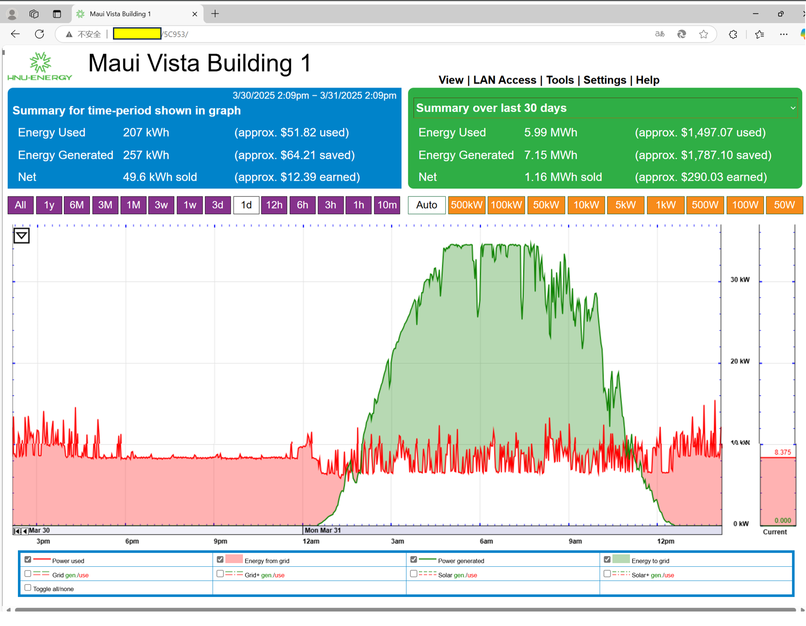
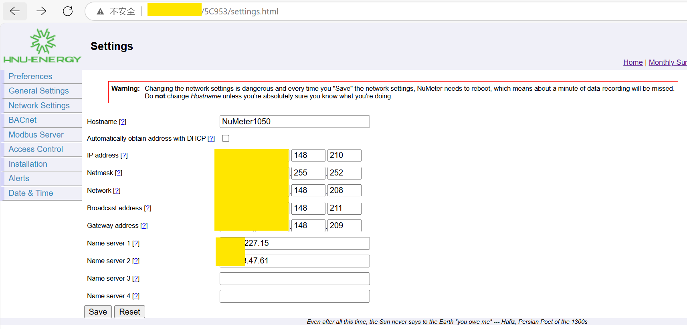
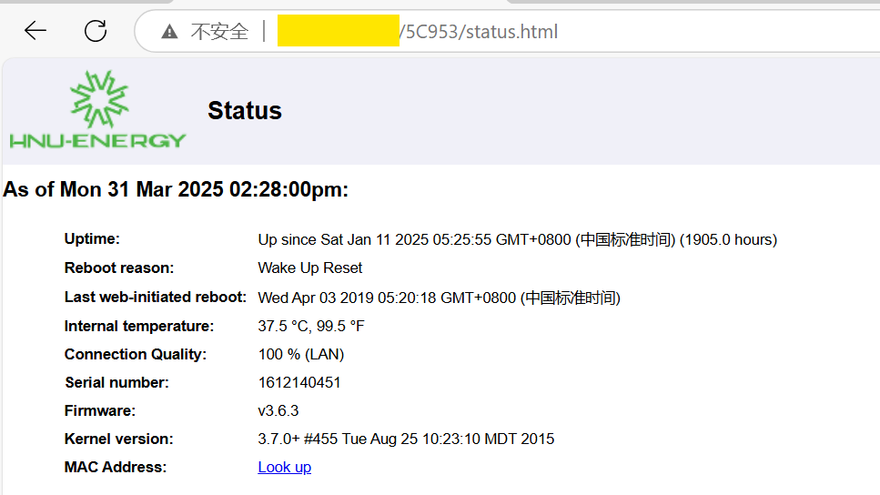

# Vulnerability Description

## Unauthenticated Sensitive Data Exposure in eGauge EG3000 Energy Monitor Web Interfaces

## CWE-ID: 
- CWE-306: Missing Authentication for Critical Function
- CWE-200: Exposure of Sensitive Information to an Unauthorized Actor

## Vulnerability Overview:
The EG3000 energy monitoring device exposes multiple unauthenticated web interfaces, allowing unauthorized actors to retrieve sensitive operational and user data without authentication. This violates the principle of least privilege and exposes three categories of critical information:

- Energy Usage Data: Real-time and historical electricity consumption patterns, potentially revealing occupancy habits or business operations.

- Network Configuration: Device network settings, including connectivity details that could facilitate lateral network movement.

- System Telemetry: Software environment details (OS, packages) that may aid further exploit development.

## Impact:

- Privacy Violation: Energy usage patterns may disclose resident behaviors/commercial operations.

- Reconnaissance: Network configuration data assists attackers in mapping internal infrastructure.

- Attack Surface Expansion: System environment details enable targeted exploits against known vulnerabilities.

## POC:

